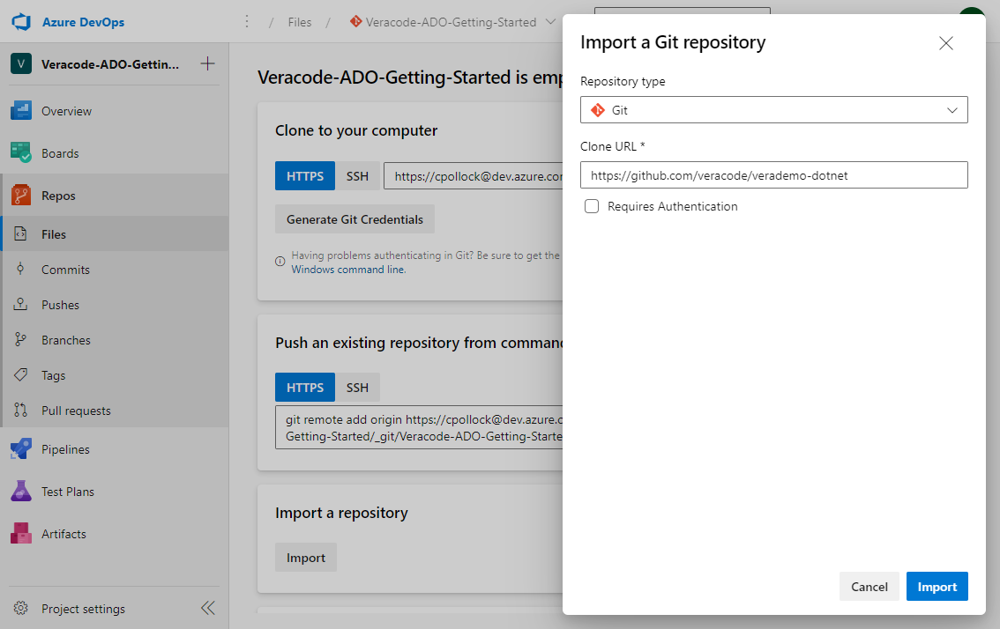
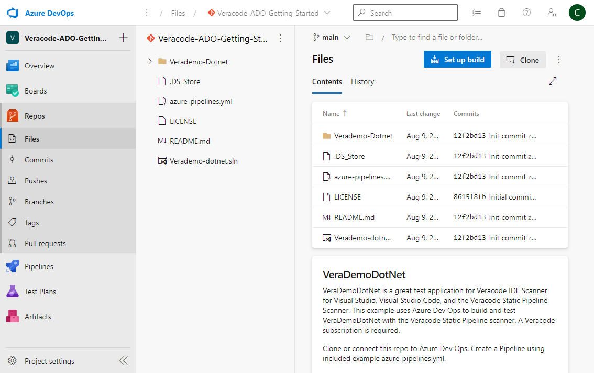
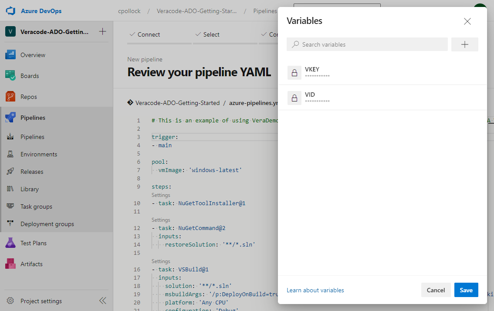
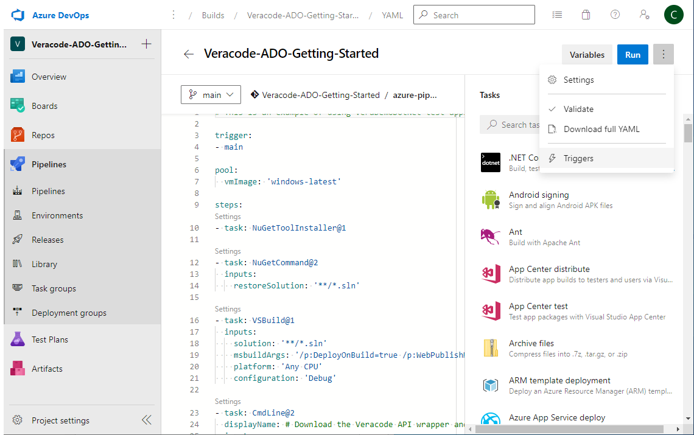
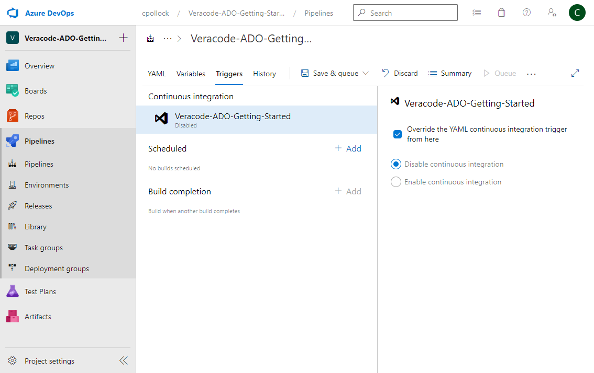
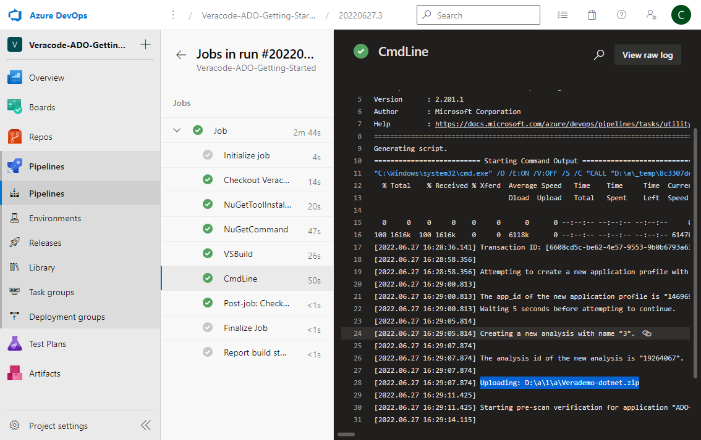
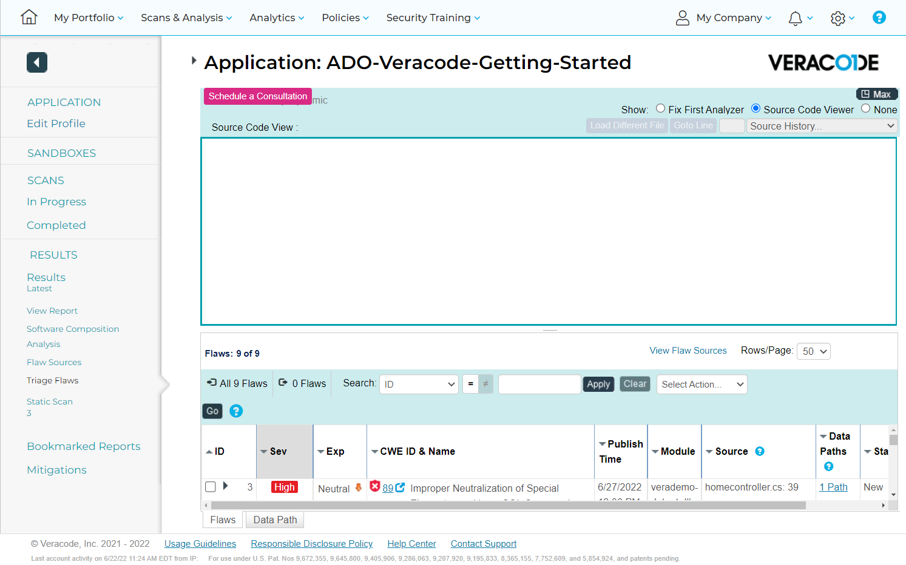

[Return to Index](/index.md)

# Veracode-Azure-DevOps-Getting-Started-Guide
How to get started with Veracode security scanning in Azure DevOps.

For this example we will demonstrate a Static + Software Composition Analysis Policy scan.

We can use VeraDemoDotNet for this example.

https://github.com/veracode-demos-labs/verademo-dotnet

## Process to Scan
* Checkout code
* Build code / create artifact
* Scan

## Configuration Steps
* Create project
* Import code
* Create API key variables
* Paste in example yml 
* For convenience, disable continuous integration

### Getting Started
Create a new project, click Repos, and then click Import.  
Import the https://github.com/veracode-demos-labs/verademo-dotnet repo.



Click the Setup Build button and paste in the below yml.
The example yml will checkout the code, build the app, and submit the application for a Static + Software Composition Analysis Policy scan.



```bash
# This is an example of using VeraDemoDotNet test application with the Veracode Security Scanning.  A Veracode subscription is required. The example yaml will checkout the code, build the app, and submit the application for a Static Policy and Software Composition Analysis scan.

# Checkout code
trigger:
- main

pool:
  vmImage: 'windows-latest'

steps:
- task: NuGetToolInstaller@1

# Restore open source
- task: NuGetCommand@2
  displayName: Restore open source
  inputs:
    restoreSolution: '**/*.sln'

# Build and artifact code
- task: VSBuild@1
  displayName: Build and artifact code
  inputs:
    solution: '**/*.sln'
    msbuildArgs: '/p:DeployOnBuild=true /p:WebPublishMethod=Package /p:PackageAsSingleFile=true /p:SkipInvalidConfigurations=true /p:PackageLocation="$(build.artifactStagingDirectory)"'
    platform: 'Any CPU'
    configuration: 'Debug'

# Submit the scan
- task: CmdLine@2
  displayName: # Static Policy + SCA scan
  inputs:
    script: |
      curl -O https://repo1.maven.org/maven2/com/veracode/vosp/api/wrappers/vosp-api-wrappers-java/22.5.10.0/vosp-api-wrappers-java-22.5.10.0.jar
      java -jar vosp-api-wrappers-java-22.5.10.0.jar -vid $(VID) -vkey $(VKEY) -appname Temp1235445 -action UploadAndScan -createprofile true -criticality Medium -version 3 -filepath $(build.artifactStagingDirectory)\Verademo-dotnet.zip

# For more wrapper parameter options, see https://docs.veracode.com/r/r_wrapper_parameters
```

Create build variables called VID and VKEY. Login to the Veracode platform and click your profile to generate your API keys.  



To disable automatic pipeline running upon commit, click the three dots next to the run button.  Then click Triggers and check box for disable continuous integration.



Check box for disable continuous integration.



Click the Save & queue button to run the build.  You can see in the build logs that Verademo-dotnet.zip was submitted for a Static and SCA scan.



Log into the Veracode platform to see the results.




## To go further, leverage the following plugins -


### Official Veracode Azure DevOps plugin:
Enables Static/SCA Policy, Sandbox, and work items import.

https://marketplace.visualstudio.com/items?itemName=Veracode.veracode-vsts-build-extension

Video Overview:

[](https://ezwp.tv/V3HIBkl8)

### Veracode Static Pipeline Scanner in Azure DevOps

https://marketplace.visualstudio.com/items?itemName=JulianTotzek-Hallhuber.VeracodePipelineScan